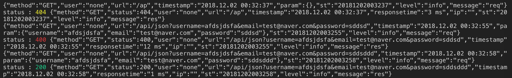

# koa-skeleton

## Basic Feature
- Use mongodb in Koa2: [mongoose](https://mongoosejs.com)
- Log Service: [winston](https://github.com/winstonjs/winston)
- Params Validation: [Joi](https://github.com/hapijs/joi)
- Template Engine: [ejs](https://github.com/mde/ejs)
- Mailer Service: [nodemailer](https://nodemailer.com)
- Authenticate User: [jsonwebtoken](https://github.com/auth0/node-jsonwebtoken)


## Getting Started

```zsh
$ mkdir your-project-name
$ git clone https://github.com/LuceteYang/koa-skeleton.git your-project-name
$ cd your-project-name
$ rm -rf .git && git init
$ cp .env.copy .env
$ mv README.md README_TEMP.md && echo "# your-project-name" >> README.md
```

```zsh
$ npm install
$ npm start
```

## Init
`Joi.validateThrow` If the variable validation passes, the data object is returned; if it fails, a user-level error occurs. 
`Mongo` Db connect requests.
`Mailer` send when server start
```
Joi.validateThrow = function validateThrow(...args) {
  const result = Joi.validate(...args);
  const err = result.error;
  if (err) {
    err.status = 400;
    throw err;
  } else {
    return result.value;
  }
};
// mongodb connet
mongoose.Promise = global.Promise; // Use Native Promise
mongoose
    .connect(process.env.MONGO_URI, {
        useNewUrlParser: true
    })
    .catch(err => {
        logger.error("mongodb connect failed", err);
    });

// mailer send when server start
if (process.env.NODE_ENV === "production") {
  require("./lib/mailer")
    .serverStart()
    .catch(err => {
      logger.error("sendmailer serverStart error ", err);
    });
}
```
## Logger

- request log

method user url timestamp param timestamp st message


- response log

method status user url timestamp responsetime ip param st level message




## Test

- mailer test
```zsh
$ npm run prd
```
then mailer will send to your mail

- db test
```zsh
$ npm install
$ npm start
```
>check  
>http://localhost:4000/api  
>http://localhost:4000/api/string  
>http://localhost:4000/api/json?username=yang&email=abc@def.com&password=111111   

=> {"msg":["Successfully connected to mongodb"],"level":"info","message":"info"} then db connect

- logger test

```zsh
$ npm run prd
```
then log file will be created in logs folder.


